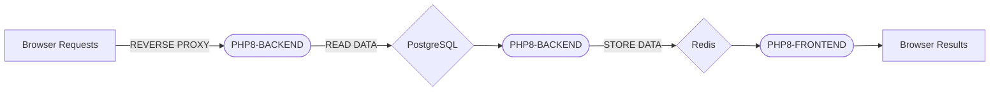

# PHP + POSTGRESQL + REDIS in K8s

## Challenge
This project shows how to create a setup for a local env with PHP, PGSQL, and REDIS in K8s that could be used for day-to-day development. 

It is tested locally, but it can be used also for pipelines like the gitlab-ci, or using your own docker-registry or DigitalOcean / Heroku and tested in the cloud like Azure, AWS EKS...

*Working with helm charts/kustomization/docker-compose and recently mostly with GitOps in AWS in an awesome infra with Flux+CrossPlane+SOPS+Traefik+Calico, I'll consider this project a basic project that shows a multi-approach to configure the KUBE environments.
It is using the normal k8s base64 secrets, but can be configured also with secret-manager/rotation ect...*

**In this projecy you'll find few:**
 - Elementary BASH scripting. 
 - Elementary PHP scripting. 
 - Elementary Docker knowledge. 
 - Elementary Kubectl knowledge. 
 - Elementary Linux knowledge. 
 - Elementary Redis/NOSQL knowledge. 
 - Elementary PGSQL knowledge.
 - How to build a docker image.
 - How to use ConfigMaps / Secrets / Replica / envs
 - How to use the networks and the persistent volumes.

## Files / Folders

|        WHERE        |WHAT                          |WHY                         |
|----------------|-------------------------------|-----------------------------|
|/deploy.sh |`To run with args start / stop'`            |Makes the pods and forward the APP port 8000 to localhost           |
|/php/          |`Contains the docker build folder with the PHP code APP and the Kube manifests to deploy.`            |NGINX Proxy to serve PHP8-PFM           |
|/postgresql/          |`Contains the Kube POSTGRESQL manifests to deploy.`|Sample employees data to load|
|/redis/          |`Contains the Kube REDIS manifests to deploy.`|Basic Redis with AUTH|

## Get ready!
***The Kube project is composed of 3 components:***
1. A PHP-FPM + NGINX as Deployment
2. A Postgres database as StateFulSet.
3. A Redis server as a caching server as Deployment.

The bash script **./deploy.sh** will create the ENV to test it locally.

    :~# chmod a+x deploy.sh
    :~# ./deploy.sh start

 - It builds a PHP8-FPM docker image named 'php' with the APP files, and the necessary libraries to run PostgreSQL and Redis (similar to a pipeline stage).
   
 - Then the script will deploy the pods (deployments, configmaps,   secrets, services)
 - You can visit https://localhost:8000 from your browser the result.

## Get down!

The bash script **./deploy.sh** will shutdown the ENV.

    :~# ./deploy.sh stop
## Remove Docker images

    :~# docker image prune -a

